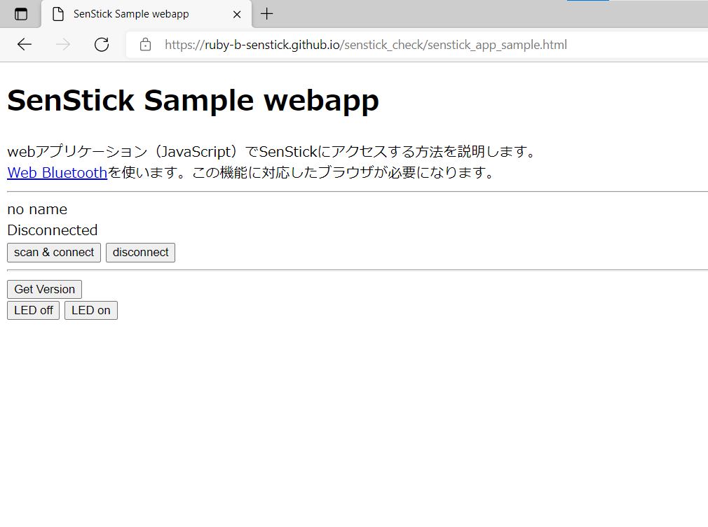
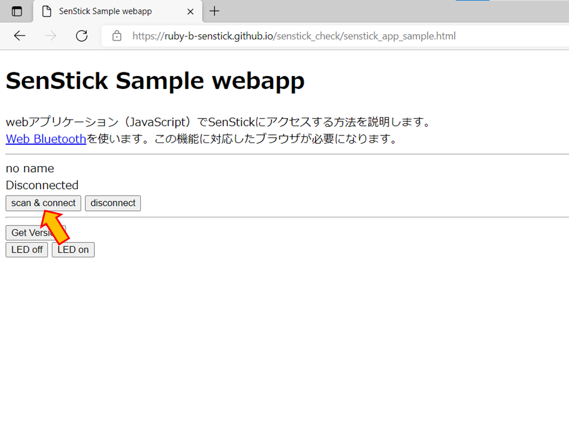
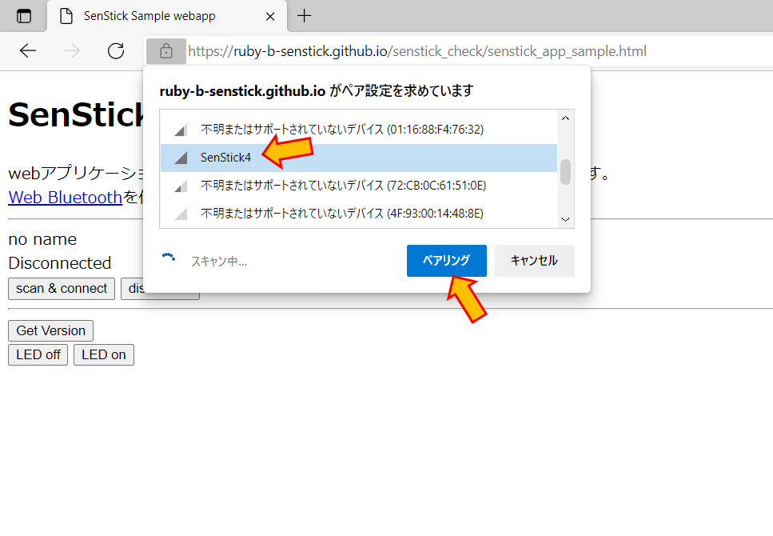
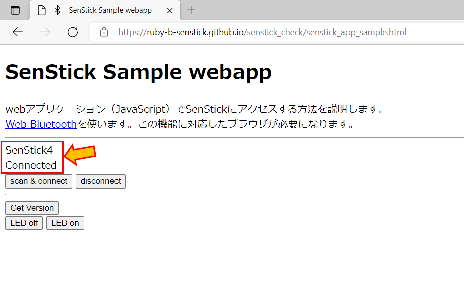
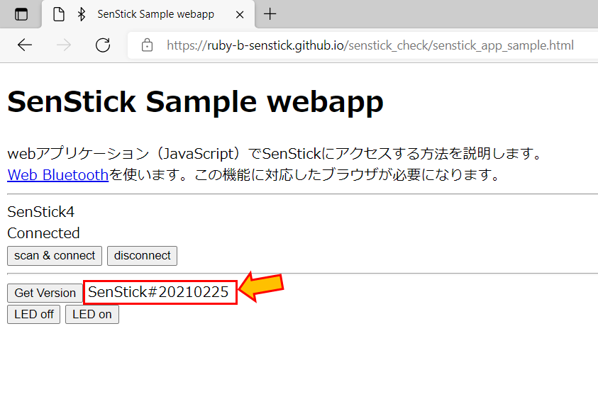

# SenStickの接続と動作確認

SenStick本体へのアクセスは、BLE（Bluetooth Low Energy）を使います。ブラウザを使って、BLEでアクセスするためのアプリケーションにより、SenStickを簡単に操作できます。

「SenStickの接続と動作確認」では、最も簡単なアプリケーションを使って、SenStickの動作を確認します。

## 手順１．ブラウザアプリケーションの起動

以下の URL クリックして、senstick_app_sample アプリケーションを起動します。マウス右クリックで、新しいウィンドウで開く（または、新しいタブで開く）ことで、以降の手順を操作しやすくなります。

- [senstick_app_sampleを実行する](https://ruby-b-senstick.github.io/senstick_check/senstick_app_sample.html)

## 手順２．SenStickの電源を入れる

SenStickにUSBで電源を供給するか、または、バッテリを接続して、SenStickの電源を入れます。電源投入時に、赤色LEDが約2秒間点灯します。

## 手順３．SenStickと接続する

ブラウザで、「Scan&Connect」ボタンをクリックします。

周囲のBLEデバイスの一覧が表示されるので、「SenStick4」を選択して、「ペア設定」ボタンをクリックします。

ここで「SenStick4」が表示されない場合は、一度SenStcikの電源を落として、電源を入れなおしてみてください。

ブラウザで、「SenStick4」「Connected」を表示されれば、正しく接続されています。

## 手順４．SenStickとの通信確認（１）

「Get Version」をクリックすると、SenStickのバージョンが「SenStick#20210225」のように表示されます。

## 手順５．SenStickとの通信確認（２）

「LED on」「LED off」をクリックすることで、SenStick上の赤色LEDの点灯・消灯を制御できます。

## まとめ

このチュートリアルを手順通りに進めることができれば、SenStickの動作確認は完了です。

BLEを使って、ブラウザとSenStickを通信できることが確認できました。

