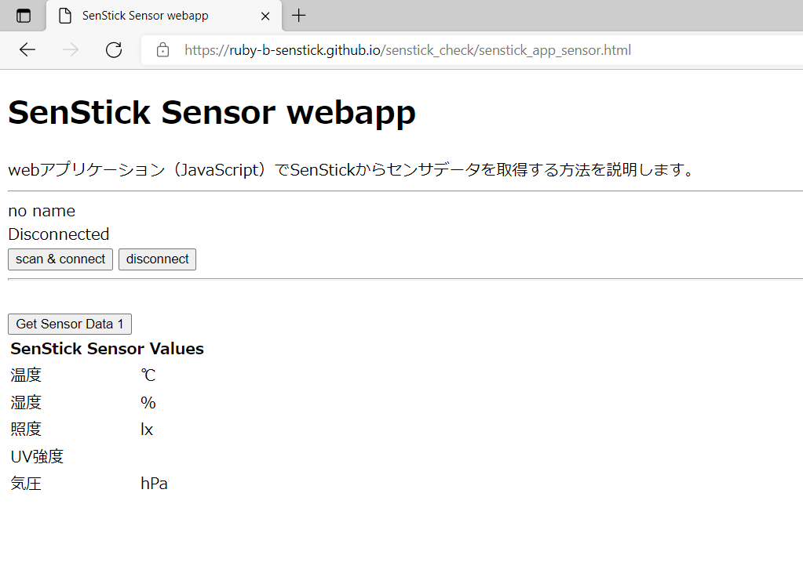
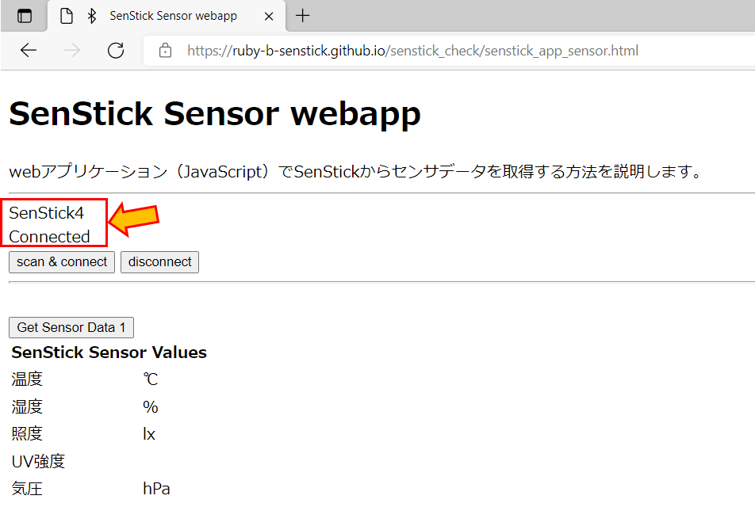
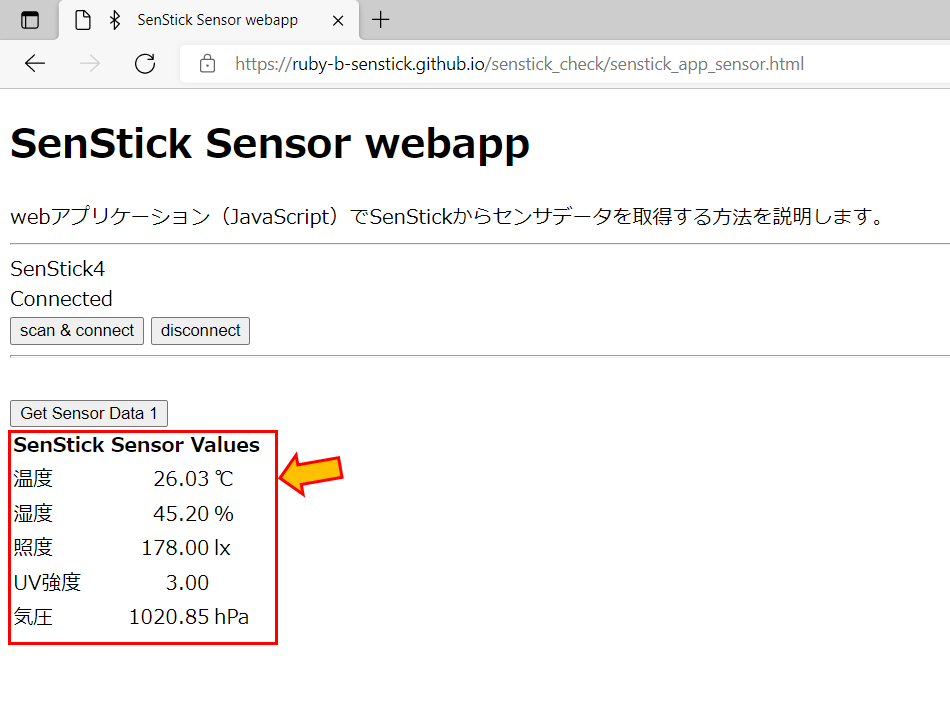

# SenStickのセンサデータ取得

「SenStickのセンサデータ取得」では、ブラウザ上でSenStickに搭載されているセンサを扱う方法について説明します。

SenStickには以下のセンサが搭載されています。それぞれのセンサは以下の周期で値の更新が行われます。

|センサ|周期（ミリ秒）|
|---|---|
|温湿度センサ|2500|
|照度センサ|1000|
|UVセンサ|1000|
|気圧センサ|5000|
|9軸センサ|500|

## 手順１．ブラウザアプリケーションの起動、SenStickと接続する

以下の URL クリックして、senstick_app_sample アプリケーションを起動します。マウス右クリックで、新しいウィンドウで開く（または、新しいタブで開く）ことで、以降の手順を操作しやすくなります。

- [senstick_app_sensorを実行する](https://ruby-b-senstick.github.io/senstick_check/senstick_app_sensor.html)

次に、「SenStickの接続と動作確認」と同様にして、SenStickと接続します。ブラウザで、以下のように「SenStick4」「Connected」と表示されれば、正しく接続されています。

## 手順２．センサデータを取得する

ブラウザの「Get Sensor Data1」をクリックすると、各センサデータを取得できます。

センサの値は、上の表に記載された「周期」で更新されます。

## まとめ

このチュートリアルでSenStickに搭載されたセンサの値を、BLEを使って、アクセスできることが確認できました。
