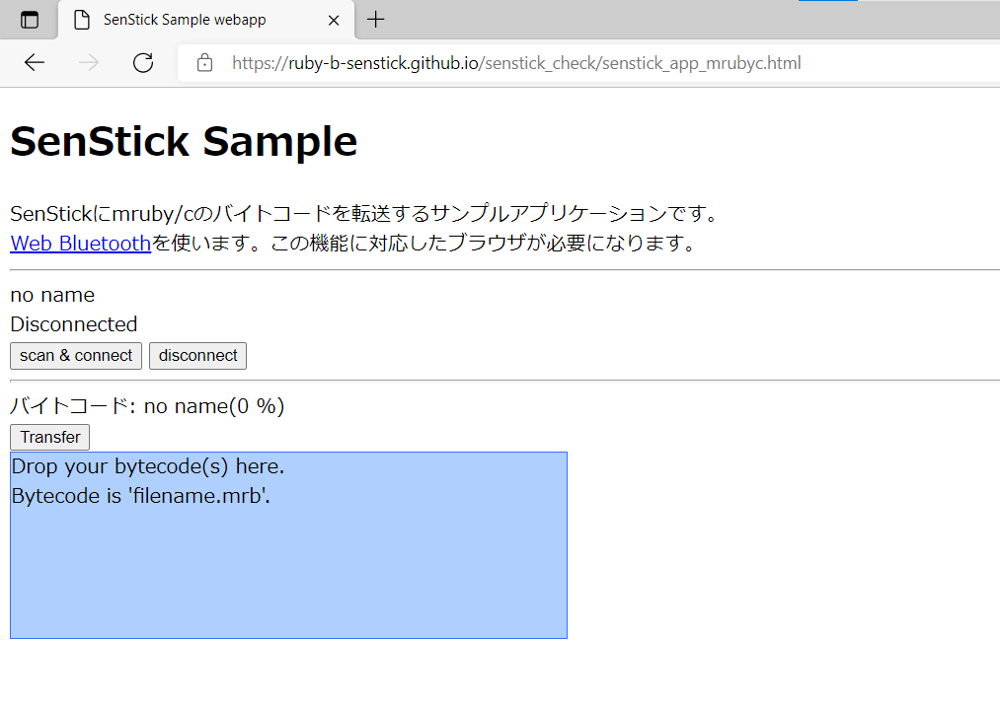
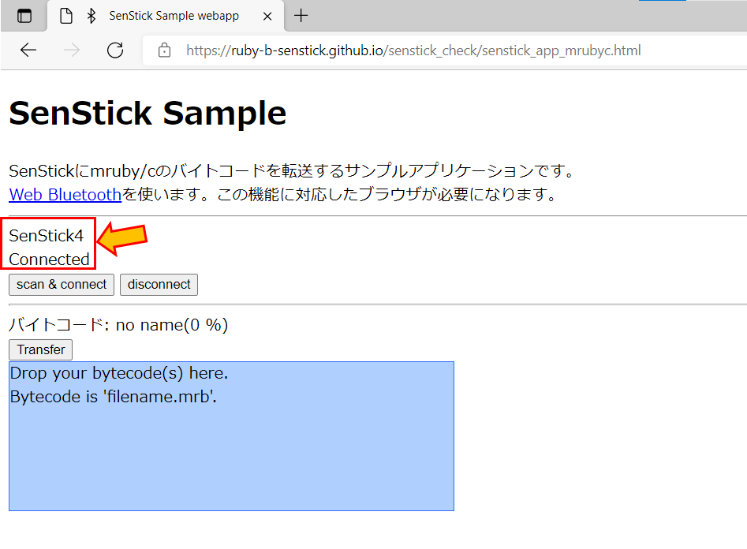
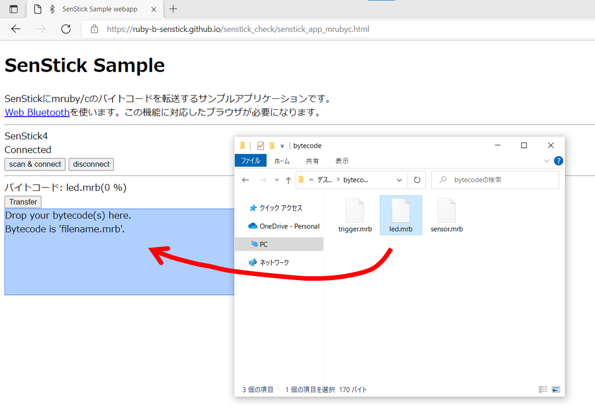
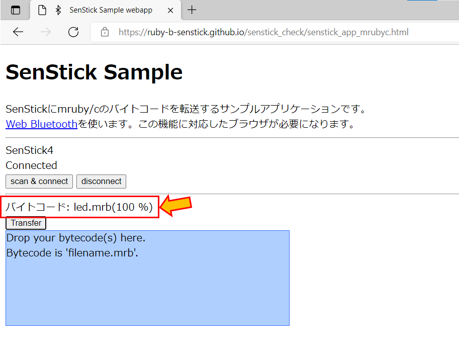

# mruby/cのプログラムの実行

「mruby/cのプログラムの実行」では、SenStickでmruby/cのプログラムを実行する方法について説明します。

SenStickには、mruby/cを実行するためのVM（プログラムを実行する機能）が搭載されています。パソコン上で開発したプログラムを、BLEを使いSenStickに転送して実行できます。

ここでは、あらかじめ準備したバイトコードを使って、SenStickへプログラムを転送する方法を説明します。

## 手順１．mruby/cバイトコードのダウンロード

以下の3つのmruby/cバイトコードをダウンロードします。「サンプルプログラム(バイトコード）」をクリック（または、右クリックで保存）してください。

|サンプルプログラム(バイトコード）|説明|
|---|---|
|[led.mrb](https://ruby-b-senstick.github.io/senstick_check/mrubyc_sample/led.mrb)|LEDが点滅する|
|[sensor.mrb](https://ruby-b-senstick.github.io/senstick_check/mrubyc_sample/sensor.mrb)|温度センサを使う。温度が30℃を超えるとLEDが点灯する|
|[trigger.mrb](https://ruby-b-senstick.github.io/senstick_check/mrubyc_sample/trigger.mrb)|光センサを使う。明るさが変化するとLEDが点灯する|

## 手順２．ブラウザアプリケーションの起動、SenStickと接続する

以下の URL クリックして、senstick_app_mrubyc アプリケーションを起動します。

- [senstick_app_mrubycを実行する](https://ruby-b-senstick.github.io/senstick_check/senstick_app_sensor.html)

次に、「SenStickの接続と動作確認」と同様にして、SenStickと接続します。ブラウザで、以下のように「SenStick4」「Connected」と表示されれば、正しく接続されています。

## 手順３．mruby/cバイトコードの転送

ダウンロードしたバイトコードを、ドラッグして、アプリケーション内の青色の領域にドロップします。これにより、転送するバイトコードが設定されます。

ドラッグ＆ドロップしたあとで、「Transfer」ボタンをクリックすると、バイトコードの転送が開始します。転送量が表示され、100%に達したら転送完了です。

転送が完了すると、SenStickが再起動し、転送されたバイトコードが実行されます。

## （参考）転送済みのバイトコードについて

転送されたバイトコードは、SenStickに書き込まれてから実行されます。一度書き込まれたバイトコードは、SenStickの電源を切っても保持されています。次回、SenStickを起動した際には、転送済みのバイトコードが自動的に実行されます。

転送済みバイトコードを消去するには、プログラム消去を行ってください。プログラム消去は以下の手順で行います。

- SenStickのボタンを長押しします（ボタンは押したまま）
  SenStickのLEDが点滅します。点滅速度が3段階に変化します
- LEDが最も速く点滅するタイミングでボタンから手を放します
  SenStick内蔵のプログラムが消去され、工場出荷時のプログラム（起動時に一度だけLEDが点灯する）になります
