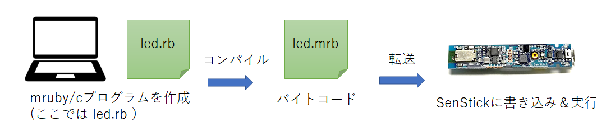
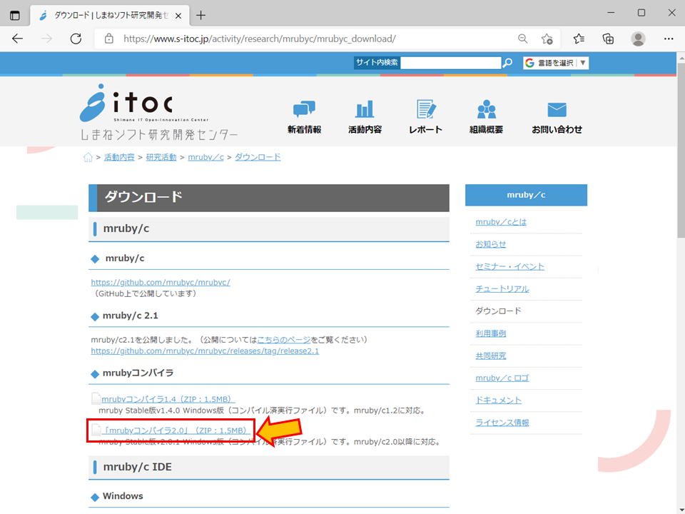

<style>
img {
    border: 3px black solid;
}
</style>

# mruby/cプログラムの作成

「mruby/cプログラムの作成」では、PC上で作成したmruby/cプログラムをSenStickへ転送し、実行について説明します。




mruby/cプログラム（図では、led.rb）を作成し、コンパイルによりバイトコード（led.mrb）を生成します。mruby/cプログラムコンパイルするため、コンパイラが必要です。

## 手順１．mruby/cコンパイラのダウンロードと展開

コンパイラは、[しまねソフト研究開発センター](https://www.s-itoc.jp/)で配布されています。

[しまねソフト研究開発センターのmruby/cダウンロード](https://www.s-itoc.jp/activity/research/mrubyc/mrubyc_download/)にアクセスします。

この中の、「mrubyコンパイラ2.0」（ZIP：1.5MB）をダウンロードします。



ダウンロードしたファイルを展開します。他のファイルも生成されますが、「mrbc.exe」のみ使います。


## 手順２．mruby/cプログラムの作成

エディタを開き、次のプログラムを入力します。

ここでは、SenStick上の赤色LEDを 0.05秒（50ミリ秒）で点滅させるプログラムを記述しています。

```Ruby
while true do
  led 1
  sleep 0.05
  led 0
  sleep 0.05
end
```

このプログラムを、`led.rb` として保存します。保存場所は、`mrbc.exe`と同じフォルダにしておくと便利です。

## 手順３．mruby/cプログラムのコンパイル

コマンドプロンプトを開き、`mrbc.exe`と`led.rb`のフォルダに移動します。以下のコマンドを入力することで、コンパイルします。

```
mrbc.exe led.rb
```

コマンドを実行すると、バイトコード`led.mrb`が生成されます。

## 手順４．バイトコードの転送

バイトコードの転送は、「[3. mruby/cのプログラムの実行](./tutorial-3.md)」で説明した通りです。


