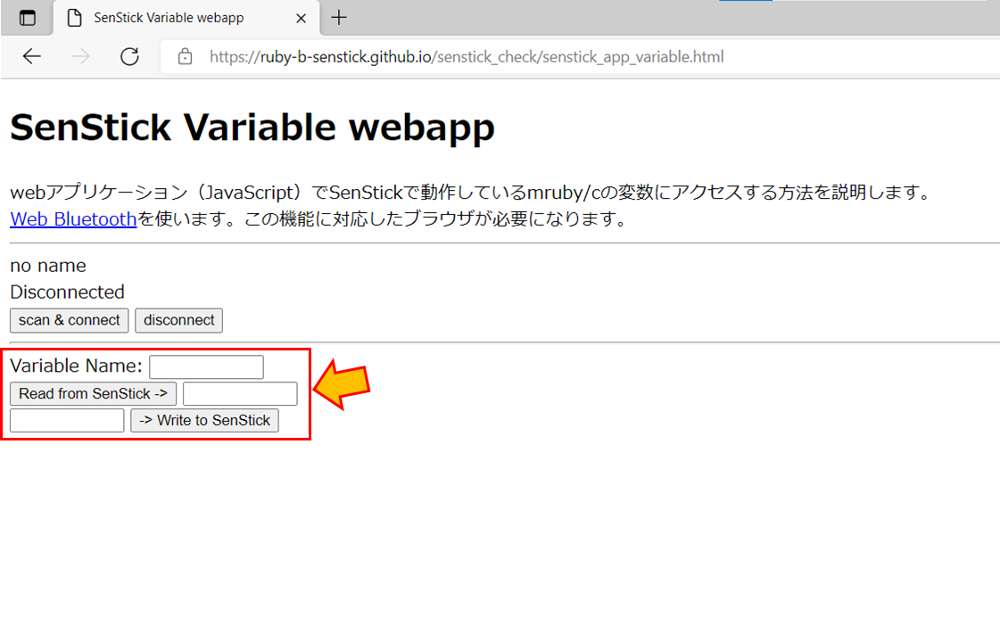

<style>
img {
    border: 3px black solid;
}
</style>

# mruby/cプログラム内変数

SenStick4では、mruby/cプログラムのグローバル変数（変数名の先頭が「`$`」で始まる変数）をブラウザからアクセスできます。

ここでは、簡単なプログラムの実行を使って、変数アクセスの方法を説明します。

## 手順１．mruby/cプログラムの作成

以下のmruby/cプログラム `variable.rb` を作成します。

このプログラムでは、SenStick4の温度センサから値を読み取り、グローバル変数 `$ondo` に格納しています。

```Ruby
sensor = SenStickIF.new([:temperature])

while true do
  $ondo = sensor.get(:temperature)
  sleep 0.5
end
```

## 手順２．mruby/cプログラムのコンパイル

以下のコマンドを入力することで、`variable.rb` をコンパイルします。

```
mrbc.exe variable.rb
```

コマンドを実行すると、バイトコード`variable.mrb`が生成されます。

## 手順３．バイトコードの転送

バイトコードの転送は、「[3. mruby/cのプログラムの実行](./tutorial-3.md)」で説明した通りです。

## 手順４．ブラウザから変数を参照

ブラウザで、「Variable Name:」に「`ondo`」と入力し、「Read from SenStick ->」ボタンをクリックします。



SenStick内のmruby/cプログラムで計測した温度がブラウザに表示されます。

## プログラムの説明

SenStickでは、以下のプログラムが実行されます。

```Ruby
sensor = SenStickIF.new([:temperature])

while true do
  $ondo = sensor.get(:temperature)
  sleep 0.5
end
```

プログラム中の `sensor.get(:temperature)` で温度データを取得します。その値を、変数`$ondo` に代入しています。

SenStcikでは、mruby/cプログラムで使われる先頭が`$`で始まる変数をブラウザから参照できるようになっています。よって、計測した温度データがブラウザからアクセスできるようになります。


